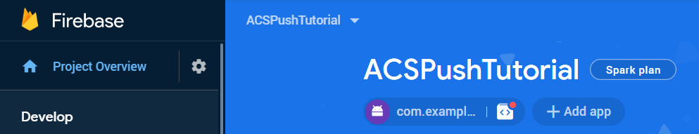

# Passaggio 1: creazione dell&#39;app [!DNL Android] e configurazione per l&#39;utilizzo di [!DNL Firebase Cloud Messaging]

In questa parte verrà creata l&#39;app [!DNL Android] per ricevere [!UICONTROL Push notifications] inviato da Adobe Campaign Standard. Per ricevere le notifiche push, l&#39;app deve essere registrata con Google [!DNL Firebase Cloud Service].

1. Accedi al tuo account [!DNL Firebase].

   [!DNL Firebase] è la piattaforma mobile di Google che consente di sviluppare rapidamente app di alta qualità. Se non hai un account [!DNL Firebase], creane uno [da qui](https://firebase.google.com).

2. Avvia [!DNL Android Studio]
3. Fare clic su **[!UICONTROL File]** > **[!UICONTROL New]** > **[!UICONTROL New Project].**
4. Selezionare **[!UICONTROL Empty Activity]** e fare clic su **[!UICONTROL Next].**

   

5. Specifica un nome significativo per il progetto.

   Ai fini di questa demo abbiamo denominato il nostro progetto come *[!DNL ACSPushTutorial]*

   

6. Accettare i nomi dei pacchetti predefiniti e fare clic su **[!DNL Finish]** per creare il progetto.
7. La struttura del progetto deve essere simile alla schermata seguente

   

8. Fare clic su **[!UICONTROL Tools]** > **[!UICONTROL Firebase].** (aggiunge il progetto a [!DNL Firebase])
9. Fare clic su **[!UICONTROL Set up Firebase Cloud Messaging].**

   

10. Fare clic su **[!UICONTROL Connect to Firebase].**
11. Dopo aver connesso l&#39;app a Firebase, fai clic su **[!UICONTROL Add FCM to your app].**
12. Fare clic su **[!UICONTROL Accept Changes].**

   Quando aggiungi FCM all’app, la procedura guidata richiede l’autorizzazione per apportare alcune modifiche al progetto.

   ![[!DNL add-fcm-to-your-app]](assets/firebase-add-fcm-to-app.PNG)

Una volta completata l’integrazione dell’app con Firebase, dovresti ricevere un messaggio simile a quello mostrato di seguito:

![[!DNL fcm-successfull]](assets/android-firebase-success.PNG)

[Verifica che il progetto sia elencato in [!DNL Firebase &#x200B;]console](https://console.firebase.google.com/)

## Configura impostazioni [!UICONTROL Push Channel]

1. Accedi alla console [!DNL Firebase]
2. Apri il progetto **[!UICONTROL ACSPushTutorial]**.
3. Fai clic sull&#39;**icona ingranaggio** e apri le impostazioni del progetto

   

4. Selezionare la scheda **[!UICONTROL Cloud Messaging]**.
5. Copia la chiave del server

   

6. Accedi all’istanza di Adobe Campaign Standard
7. Fare clic su **[!UICONTROL Adobe Campaign]** > **[!UICONTROL Administration]** > **[!UICONTROL Channels]** > **[!UICONTROL Mobile App].**
8. Seleziona **[!UICONTROL Mobile Application Property].** appropriato
9. Fare clic sull&#39;icona **[!DNL Android]** nella sezione **[!UICONTROL Push Channel settings]**.
10. Incolla la chiave del server nel campo chiave del server.

Se tutto va bene, dovresti visualizzare un messaggio di SUCCESSO.

In sintesi, è stato creato un [!DNL Android App] e l&#39;utente [!DNL Android App] è stato connesso con [!DNL Firebase]. Abbiamo quindi connesso l&#39;app mobile in Adobe Campaign con [!DNL Android App] incollando la chiave del server dell&#39;app [!DNL Android] nell&#39;app mobile in Adobe Campaign Standard.
